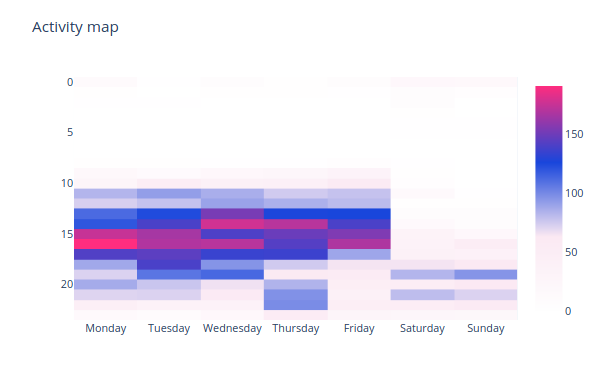

# RV stats

## What is it?

Visualize historical data of student room snack purchases using pandas, plotly, and dash.

Reads and processes raw html data from the [TKO-äly RV system](https://www.tko-aly.fi/toiminta/rv).

## Getting started

Ensure you have python 3.6.9 or newer.

To run:
```
python3 -m venv venv
. ./venv/bin/activate
pip install -r requirements.txt
python stats.py
```

Enter RV system credentials when prompted.

Dashboard will be available on http://127.0.0.1:8050/ by default.

## Examples

System activity heatmap by hour and weekday:



Interactive item purchasing trends comparison:


Dynamic system usage statistics by year:


Account balance history view:


And more!